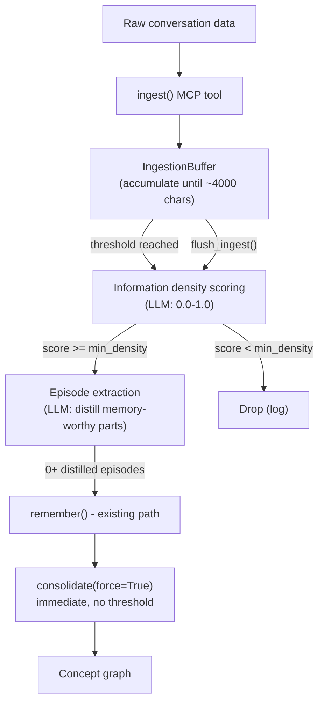

# Auto-Ingest Mode for Remind

## Context

Currently, Remind relies on the agent explicitly calling `remember()` with curated content. This has a fundamental problem: the filtering decision competes for the agent's attention with the actual task. Drawing from the Dupoux/LeCun/Malik paper on autonomous learning, this implements System M's **input selection** function -- a separate, cheaper subsystem that handles attention/curation.

## Design

### Core concept: buffered intake with information density scoring

The auto-ingest pipeline has three stages:

1. **Buffer** -- raw text accumulates in an in-memory buffer. When the buffer exceeds a character threshold (default ~4000 chars), it flushes.
2. **Information density scoring** (LLM call) -- the flushed chunk gets scored by an LLM for how much useful, memory-worthy information it contains (0.0-1.0). This replaces the earlier novelty-detection idea, which had problems: nothing to compare against when memory is empty, and "novel" doesn't mean "useful" (boilerplate is novel the first time too). Information density measures what we actually care about -- does this chunk contain decisions, preferences, facts, corrections, or surprises?
3. **Triage extraction** -- chunks that pass the density threshold get a second LLM call (or same call, two-part response) that extracts distilled episodes. These go through `remember()` and then **immediately consolidate**, bypassing the normal auto-consolidation threshold. The rationale: auto-ingest triage *is* the curation step, so episodes it produces are already vetted and should become concepts as fast as possible.

### New MCP tool: `ingest()`

```
ingest(content="<raw conversation text>", source="conversation")
```

The caller streams text into `ingest()` whenever it has new content. Remind buffers internally and processes when the buffer is full. The caller doesn't need to worry about chunking or timing.

```
ingest("User: Can you fix the auth bug?\nAssistant: Looking at it...")
  → buffer: 62 chars (below threshold, accumulate)

ingest("...I see the issue is in verify_credentials, the token expiry check uses <= instead of <...")
  → buffer: 4100 chars (threshold reached, flush)
  → density score: 0.7 (above threshold ✓)
  → triage extracts: "Auth bug in verify_credentials: token expiry uses <= instead of <"
  → remember() → immediate consolidate()
```

A `flush_ingest()` method/tool forces processing of whatever is in the buffer (for session end, etc).

### Architecture




### Information density scoring + extraction

Single LLM call that evaluates information density and extracts distilled episodes in one pass.

The triage prompt receives two inputs: the raw conversation chunk, and the **top-K most relevant existing concepts** retrieved via `recall(chunk_text, raw=True)`. This gives the LLM targeted context to judge whether information is genuinely new vs. already captured in the concept graph, without flooding the prompt with the entire concept store.

```
You are a memory curation system. You receive raw conversation fragments
and decide what's worth remembering long-term.

## EXISTING RELEVANT KNOWLEDGE
{top_k_concepts}

## RAW CONVERSATION FRAGMENT
{chunk}

Score the INFORMATION DENSITY of this text from 0.0 to 1.0:
- 0.0: Pure boilerplate, greetings, acknowledgments, routine narration
- 0.3: Some context but nothing specific or actionable
- 0.5: Contains some facts or context worth noting
- 0.7: Contains decisions, preferences, or important facts
- 1.0: Dense with critical decisions, corrections, or surprising outcomes

Information already captured in EXISTING RELEVANT KNOWLEDGE does NOT
count toward density unless it adds new nuance, corrections, or context.

If density >= 0.4, extract memory-worthy episodes as TIGHT, DISTILLED
statements. Do NOT copy conversation verbatim. Compress and rewrite
into information-dense factual statements. Strip conversational filler,
hedging, and step-by-step narration. Each episode should be a single
clear assertion that stands on its own.

Good: "Token expiry check in verify_credentials uses <= instead of <,
       causing tokens to be accepted one second past expiry"
Bad:  "The assistant looked at the auth bug and found that the issue
       is in verify_credentials where the token expiry check uses <=
       instead of <"

Output JSON:
{
  "density": 0.7,
  "reasoning": "Contains a specific bug diagnosis with root cause",
  "episodes": [
    {
      "content": "tight, distilled factual statement",
      "type": "observation|decision|preference|question|meta",
      "entities": ["type:name", ...]
    }
  ]
}

Episodes array should be empty if density < 0.4.
```

This is a single LLM call that does both scoring and extraction. If density is below threshold, the episodes array is empty and nothing is stored. The density score itself could be logged for telemetry (useful for future adaptive thresholds).

### Key design decisions

- `**ingest()` is separate from `remember()**` -- existing explicit `remember()` calls bypass triage entirely, go straight to the episode buffer, and follow normal auto-consolidation thresholds. Auto-ingest is additive.
- **Character-count buffer** -- `ingest()` accumulates text internally and only processes when the buffer hits the threshold. No constant LLM chatter.
- **Immediate consolidation after triage** -- episodes produced by auto-ingest trigger `consolidate(force=True)` immediately. The triage step already filtered for quality, so there's no reason to wait for a threshold. This does NOT affect `remember()`-created episodes, which still follow normal thresholds.
- **Single LLM call for density + extraction** -- combining scoring and extraction in one prompt avoids a round-trip. The density score determines whether episodes get stored; extraction happens in the same call.
- **Same LLM provider by default, configurable separately** -- triage uses the configured LLM provider. An optional `triage_provider` config lets you point triage at a cheaper/faster model without affecting consolidation quality.
- `**flush_ingest()`** -- forces processing of the current buffer regardless of char count. Called at session end or when the agent wants to ensure everything is processed.
- **Recall-based concept context** -- before triage, `recall(chunk_text, raw=True)` retrieves the top-K most relevant existing concepts. Only those go into the triage prompt, so the LLM has targeted context for judging "we already know this" without being overwhelmed by the full concept store. When memory is empty, the concepts section is simply empty and triage judges purely on information density.

## Outcome tagging

### New episode type: `outcome`

Add `OUTCOME = "outcome"` to `EpisodeType` in [src/remind/models.py](src/remind/models.py). An outcome episode records the result of an action or strategy, closing the feedback loop between what the agent did and what happened.

Outcome episodes use structured metadata conventions:

- `strategy` -- what approach was used (e.g., "grep-based search for function definition")
- `result` -- `success`, `failure`, `partial` 
- `prediction_error` -- `low`, `medium`, `high` -- how surprising was the result vs. expectation
- `context` -- what conditions were in play

Example outcome episode:

```json
{
  "content": "Grep search for auth logic missed main implementation because function was named verify_credentials, not authenticate",
  "type": "outcome",
  "metadata": {
    "strategy": "grep-based search for 'auth'",
    "result": "partial",
    "prediction_error": "high"
  },
  "entities": ["function:verify_credentials", "concept:search-strategy"]
}
```

### Triage prompt detects outcomes

The triage prompt (in `triage.py`) is enhanced to detect action-result pairs in raw conversation data. When the agent uses a tool and gets a result, or tries an approach that succeeds/fails, the triage LLM extracts it as an `outcome` episode with structured metadata. The prompt addition:

```
Additionally, detect ACTION-RESULT pairs: when a strategy, tool, or approach
was tried and produced a result. Extract these as "outcome" type episodes with
metadata fields: strategy (what was tried), result (success/failure/partial),
prediction_error (low/medium/high - how surprising was the outcome).
```

### Consolidation prompt enhanced for causal patterns

The consolidation prompt in [src/remind/consolidation.py](src/remind/consolidation.py) gets an additional instruction to specifically look for causal patterns in outcome-typed episodes:

```
For OUTCOME episodes, look specifically for:
- Strategy-outcome patterns: "strategy X tends to succeed/fail in context Y"
- Use 'causes' relations to connect strategies to outcomes
- Use 'contradicts' when a strategy that usually works fails, or vice versa
```

Over time, this produces concepts like "grep-based search is unreliable when function names don't match the domain term" with `causes` relations, which spreading activation will surface when the agent faces similar situations.

## File changes

### [src/remind/triage.py](src/remind/triage.py) (new)

Two classes:

- `IngestionBuffer` -- simple char-count accumulator. `add(text) -> Optional[str]` returns the flushed chunk when threshold is reached, `None` otherwise. `flush() -> Optional[str]` forces a flush. Tracks source metadata.
- `IngestionTriager` -- takes a text chunk + relevant existing concepts (via recall), calls LLM for density scoring + episode extraction. Returns a `TriageResult` with density score, reasoning, and list of `(content, episode_type, entities, metadata)` tuples. Detects action-result pairs and emits `outcome` episodes with structured metadata. Handles JSON parsing failures gracefully (falls back to storing the raw chunk as a single observation episode if LLM output is unparseable).

### [src/remind/models.py](src/remind/models.py) (modified)

- Add `OUTCOME = "outcome"` to `EpisodeType` enum

### [src/remind/consolidation.py](src/remind/consolidation.py) (modified)

- Add causal pattern instructions to `CONSOLIDATION_SYSTEM_PROMPT` and `CONSOLIDATION_PROMPT_TEMPLATE` for outcome episodes

### [src/remind/extraction.py](src/remind/extraction.py) (modified)

- Add `outcome` to the type classification list in `EXTRACTION_PROMPT_TEMPLATE`

### [src/remind/config.py](src/remind/config.py) (modified)

Add to `RemindConfig`:

- `ingest_buffer_size: int = 4000` -- character threshold for buffer flush
- `ingest_min_density: float = 0.4` -- minimum information density score to extract episodes
- `triage_provider: Optional[str] = None` -- optional separate LLM provider for triage (defaults to `llm_provider`)

### [src/remind/interface.py](src/remind/interface.py) (modified)

- Add `IngestionBuffer` and `IngestionTriager` instances to `MemoryInterface.__init__()`
- Add `async ingest(content: str, source: str = "conversation") -> list[str]`: appends to buffer, processes if threshold reached. Returns episode IDs (empty list if buffer didn't flush or triage dropped everything).
- Add `async flush_ingest() -> list[str]`: forces buffer flush + triage + consolidation. Called from `end_session()`.
- Ingested episodes that pass triage trigger `consolidate(force=True)` immediately after `remember()`.

### [src/remind/mcp_server.py](src/remind/mcp_server.py) (modified)

- Add `ingest(content, source?)` MCP tool
- Add `flush_ingest()` MCP tool
- `end_session` behavior updated to call `flush_ingest()` before consolidation

### [src/remind/cli.py](src/remind/cli.py) (modified)

- Add `remind ingest <text>` command -- accepts raw text via argument or stdin (for piping). Calls `memory.ingest()`. Shows buffer status (buffered / flushed + triage results).
- Add `remind flush-ingest` command -- forces buffer flush. Shows triage results and consolidation output.
- Update `remind end-session` to call `flush_ingest()` before consolidation.
- Update CLI docstring at top of file.

### [docs/AGENTS.md](docs/AGENTS.md) (modified)

- Add `ingest` and `flush_ingest` to tools table
- Add `outcome` to episode types
- Add auto-ingest workflow section showing when to use `ingest()` vs `remember()`
- Update "When to use" guidance

### [README.md](README.md) (modified)

- Add "Auto-ingest" to key features list with one-line description
- Add `ingest` / `flush-ingest` to CLI reference table
- Brief mention in quick start or "Two ways to use" section

### [AGENTS.md](AGENTS.md) (dev guide, modified)

- Add `triage.py` to architecture table
- Add `outcome` to episode types table
- Add auto-ingest pipeline to architecture description
- Update "Common Development Tasks" and "Important Files for Context" tables

### Website docs (modified)

- [website/reference/mcp-tools.md](website/reference/mcp-tools.md) -- add `ingest` and `flush_ingest` tool docs with parameter tables
- [website/reference/cli-commands.md](website/reference/cli-commands.md) -- add `ingest` and `flush-ingest` command docs
- [website/concepts/episodes.md](website/concepts/episodes.md) -- add `outcome` episode type with examples
- [website/concepts/consolidation.md](website/concepts/consolidation.md) -- add section on causal pattern detection from outcomes, and immediate consolidation from auto-ingest
- [website/guide/configuration.md](website/guide/configuration.md) -- add `ingest_buffer_size`, `ingest_min_density`, `triage_provider` config options
- New page: [website/concepts/auto-ingest.md](website/concepts/auto-ingest.md) -- dedicated page explaining the auto-ingest pipeline, information density scoring, outcome tagging, and when to use `ingest()` vs `remember()`

## Future extension points

### Meta-control routing (System M orchestration)

The concept graph already serves as an implicit routing table -- `recall()` at session start surfaces strategy guidance via spreading activation. To make this more explicit:

- A `meta_recall()` method that specifically queries for strategy/routing concepts
- Adaptive consolidation frequency based on "prediction error" signals (e.g., ratio of contradictions found to episodes processed)
- Stats-based telemetry: expose concept confidence distributions, contradiction rates, and density score trends as structured signals an orchestrator could act on

### Adaptive density thresholds

The density scoring creates a natural feedback loop opportunity:

- Track density scores and "yield ratio" (concepts produced per episode from triage) over time
- If yield ratio is consistently low, raise `ingest_min_density` for that domain/context
- If yield ratio is high, lower the threshold to capture more
- This is the system learning what kinds of input are worth paying attention to -- exactly the developmental curriculum the paper describes

